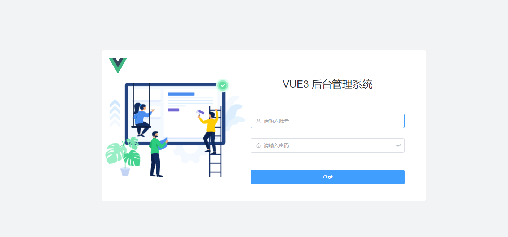
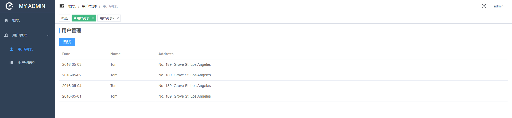

# vue3-template

### 前提

此整个框架搭建 环境要求，node和npm版本尽可能最新，若以后将webpack替换vite相对容易

```
node: v18.13.0
npm: 8.19.3
```

此框架会作为 最精简的项目 用于开发。底子搭好了，剩下只要 CV了


### 更新周期

纯属个人兴趣，更新周期不固定。

从vue2-template更新过来，保留着部分js或者不typescript代码。

下一个tag:

1.  优化代码，看起来更typescript
2. fix bug


### 技术栈

| 名称         | 描述                                     |
| ------------ | ---------------------------------------- |
| vue3         | vue核心代码库                            |
| vue-router   | vue 路由                                 |
| pinia        | vue 状态管理，替代vuex。比vuex使用更友好 |
| webpack      | 模板管理构建工具                         |
| element-plus | 核心 UI 库。issue很多，不影响真正使用    |
| lodash       | 强大的js函数库                           |
| echarts      | 核心 图表库。很强大                      |


### 运行步骤

```shell
npm install
npm run serve

# build
npm run build
```

webpack 更详细配置查看 [Configuration Reference](https://cli.vuejs.org/config/).


### 注意

此框架未提供 mock . 需搭建服务器，在`example` 下 运行

```shell
main.exe -x
```


页面展示：




