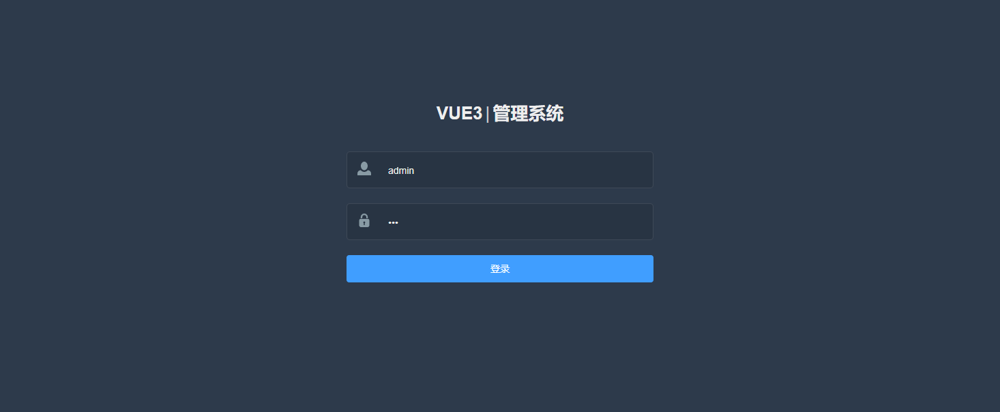
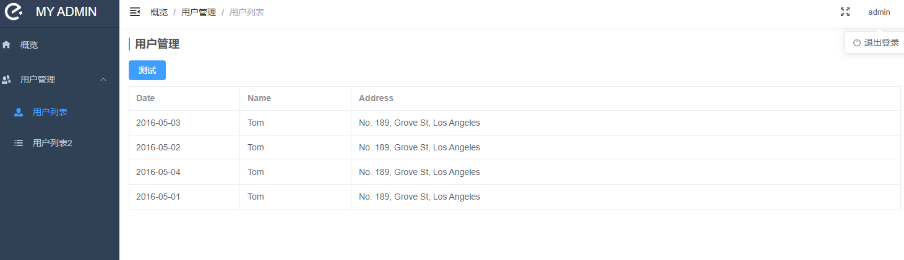

# vue3-template

## 技术栈

- [x] vue
- [x] vue-router
- [x] pinia
- [x] webpack
- [x] element-plus
- [x] lodash


## Project setup

```
npm install
```

### Compiles and hot-reloads for development
```
npm run serve
```

### Compiles and minifies for production
```
npm run build
```

### Lints and fixes files
```
npm run lint
```

### Customize configuration
See [Configuration Reference](https://cli.vuejs.org/config/).


页面展示：




